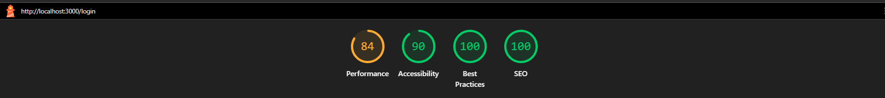
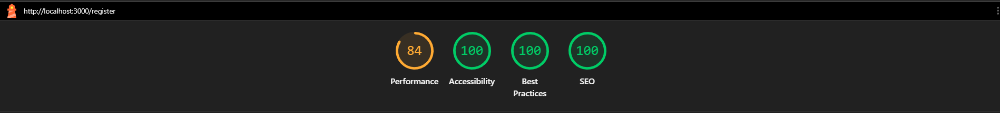
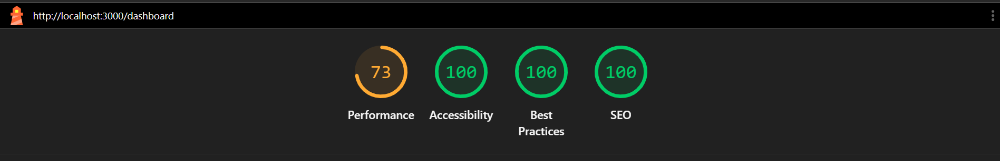
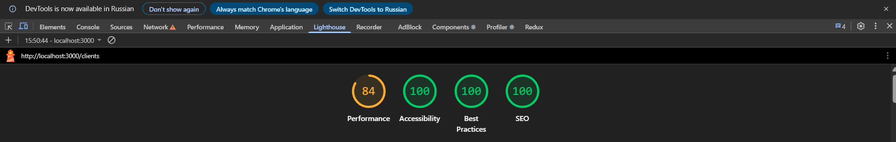
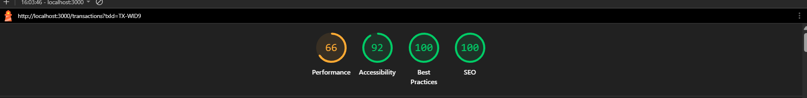

# Antifraud Management System

A modular, high-performance Single Page Application (SPA) designed for monitoring clients and reviewing financial transactions to detect and prevent fraudulent activity.

Built from scratch using React, Redux Toolkit, RTK Query, and Webpack with a Feature-Based Architecture focused on scalability, maintainability, and performance.

## 🌐 Live Demo

https://antifraud-one.vercel.app/

---
## 📊 Lighthouse Performance Audit

The application was audited using Google Lighthouse to validate performance, accessibility, best practices, and SEO quality across major application pages.

### Login Page


### Registration Page


### Dashboard


### Clients


### Transactions

---
## 🚀 Key Features

### Authentication & Security

* Login and Registration workflows
* Route protection using `ProtectedRoute` and `PublicRoute`
* Persistent user sessions via `localStorage`
* Automatic authorization header injection through RTK Query

### Client Management

* Browse and search client records
* Detailed customer profiles
* Dynamic data loading and caching

### Transaction Monitoring

* Review deposits, withdrawals, and loan transactions
* Fraud detection workflow
* Transaction approval and rejection system
* Risk scoring visualization

### Responsive Dashboard

* Adaptive desktop and mobile layouts
* Mobile burger navigation
* Profile dropdown management
* Responsive transaction review interface

### State Management & Data Fetching

* Centralized state management with Redux Toolkit
* Server-state management with RTK Query
* Automatic cache synchronization
* Background re-fetching and tag invalidation

### Routing Architecture

* React Router v6
* Nested layouts with `<Outlet />`
* Protected routes
* Catch-all 404 pages

---

## ⚙️ Installation & Running Locally

### Prerequisites

Make sure you have installed:

* Node.js (v18+ recommended)
* npm

### Clone the Repository

```bash
git clone https://github.com/Kirik1714/Antifraud.git
cd Antifraud
```

### Install Dependencies

```bash
npm install
```

### Start Development Server

```bash
npm start
```

The application will be available at:

```text
http://localhost:3000
```

### Build for Production

```bash
npm run build
```

The optimized production bundle will be generated inside the `dist` directory.

---

## 🛠️ Technology Stack

### Frontend

* React 18
* React Router DOM v6
* Redux Toolkit
* RTK Query
* SCSS Modules
* Lucide React

### Build Tools

* Webpack
* Webpack Dev Server
* Babel

### Styling

* SCSS
* CSS Modules

---

## 📂 Project Structure

```text
src/
├── app/
│   ├── store.js
│   ├── App.jsx
│   └── main.jsx
│
├── components/
│   ├── layout/
│   └── ui/
│
├── core/
│   └── api/
│       └── baseApi.js
│
├── features/
│   ├── auth/
│   ├── clients/
│   ├── dashboard/
│   └── transactions/
│
├── hooks/
└── utils/
```

---

## 🏗️ Architecture

The application follows a Feature-Based Architecture.

Each business domain is isolated inside its own module and contains:

* Components
* Pages
* Redux slices
* RTK Query endpoints
* Styles
* Business logic

This approach improves:

* Scalability
* Maintainability
* Code organization
* Team collaboration


